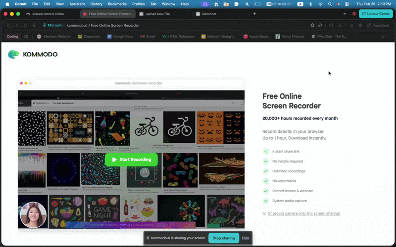

# Flask on Docker


## Overview
This repository contains a containerized Flask application using a modified Instagram tech stack. The project utilizes **Gunicorn** as the production web server, **Nginx** as a reverse proxy to handle requests and serve static/media files, and **PostgreSQL** for persistent data storage. All services are orchestrated using Docker Compose to ensure a consistent environment from development to production.

## Demo


## Build Instructions

### Prerequisites
* Docker and Docker Compose installed.
* A `.env.prod.db` file (and other required `.env` files) populated with your credentials. **Note: These are excluded from the repository for security.**

### Running the Production Stack
1. **Spin up the containers:**
   ```bash
   docker compose -f docker-compose.prod.yml up -d --build
